<p align="center">
  
</p>

*   **Easy Game Launch**: Launch Stardew Valley in either Vanilla mode or through SMAPI for modded play.
*   **Mod Manager**:
    *   Enable or disable mods effortlessly through a beautiful app interface.
    *   **NEW!** Install mods automatically by dragging and dropping `.zip` files or folders.
    *   **NEW!** Filter and tag system to quickly sort mods by category and status.
    *   **NEW!** 1-Click Mod Backup to zip your entire mods folder securely to your Desktop.
*   **Mod Config Editor**: Edit mod settings directly within the app, complete with native nested menu layouts that mirror the in-game Generic Mod Config Menu.
*   **Nexus Mods Integration**: View mod details, changelogs, and download mods directly from Nexus Mods without leaving the app.
*   **Mod Packs (Nexus Collections)**:
    *   **NEW!** Import Nexus Collections directly via `nxm://` links or URL.
    *   **NEW!** Rich collection banner: cover art, curator name, download count, revision, and game version — fetched live.
    *   **NEW!** Per-mod status: each mod shows ✅ Installed, 🟠 Disabled, or ❌ Missing with a direct Nexus download link.
    *   **NEW!** Per-mod details: thumbnail, author, Nexus ID, download count, last updated, and file version in every row.
*   **Mod Profiles**: Group mods into multiple profiles and switch between them instantly with a single click.
*   **Thai Translation Hub**: A dedicated hub listing all Thai translation mods — browse, check status, download, and track updates in one place.
*   **Save Manager**:
    *   View details of all save files (money, in-game time, season, farm layout)
    *   Duplicate or delete save files
    *   Edit money and basic character stats
*   **Developer Logs**: Monitor SMAPI output in real time directly within the app.
*   **Bilingual Support**: Switch the app language instantly between English and Thai (ภาษาไทย).
*   **Native macOS UI**: A clean, intuitive interface designed to feel right at home on macOS.

<p align="center">
  
</p>

|   |   |
| :---: | :---: |
| 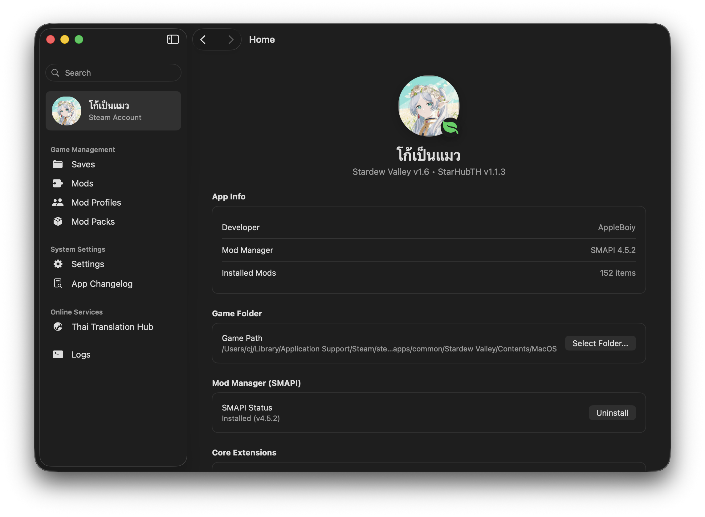 | 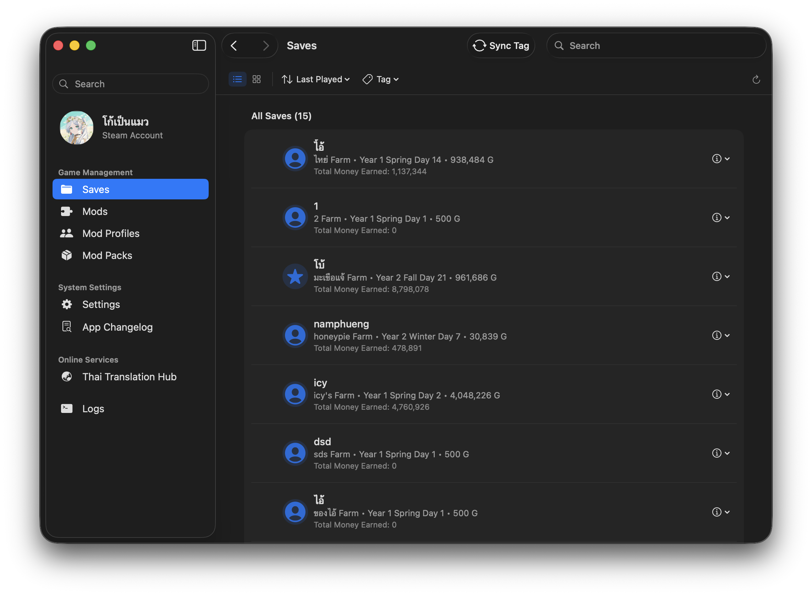 |
| 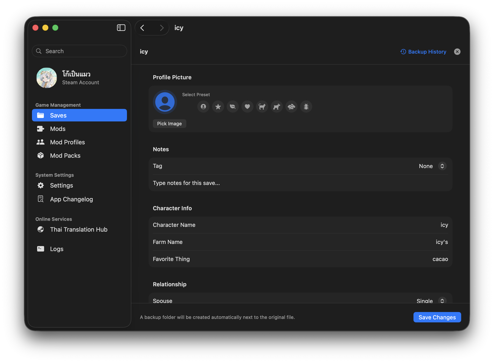 | 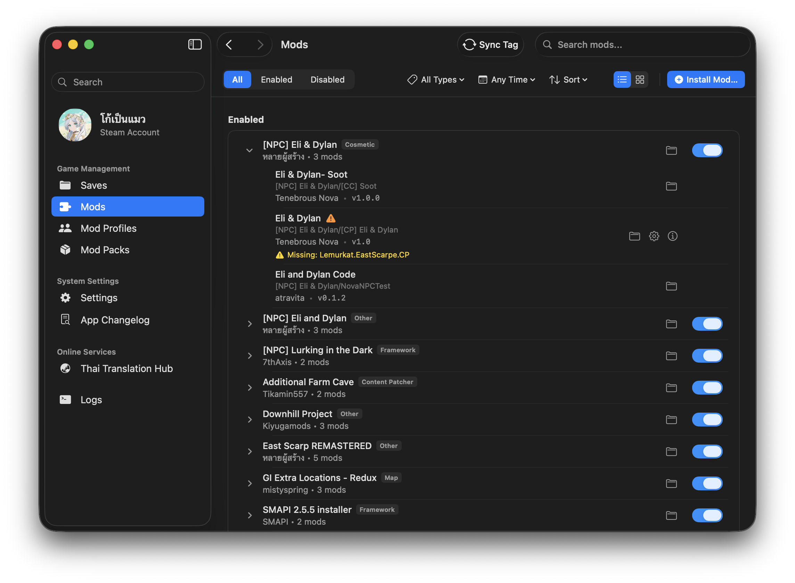 |
| 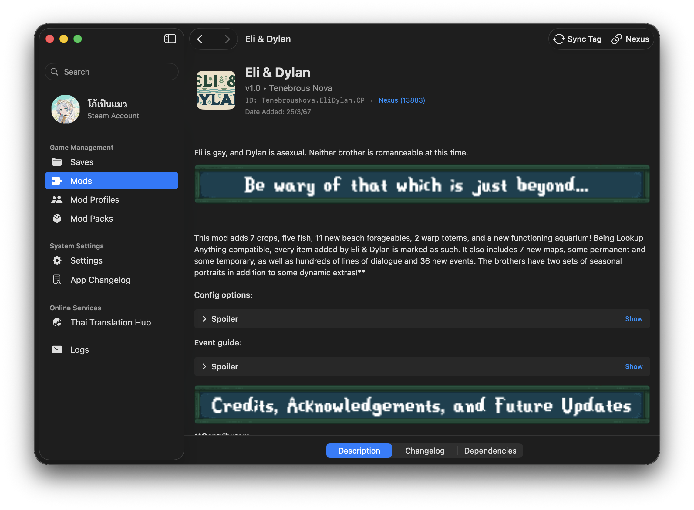 | 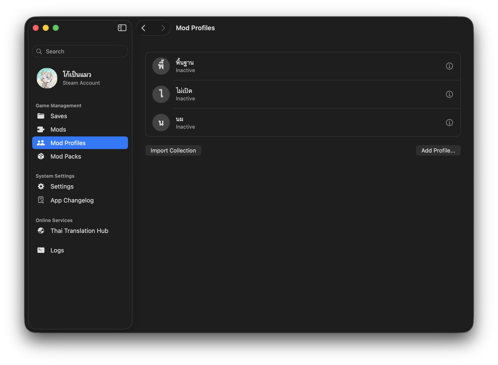 |
| 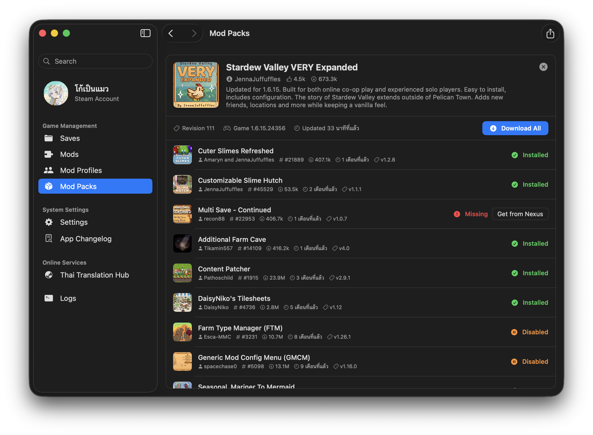 | 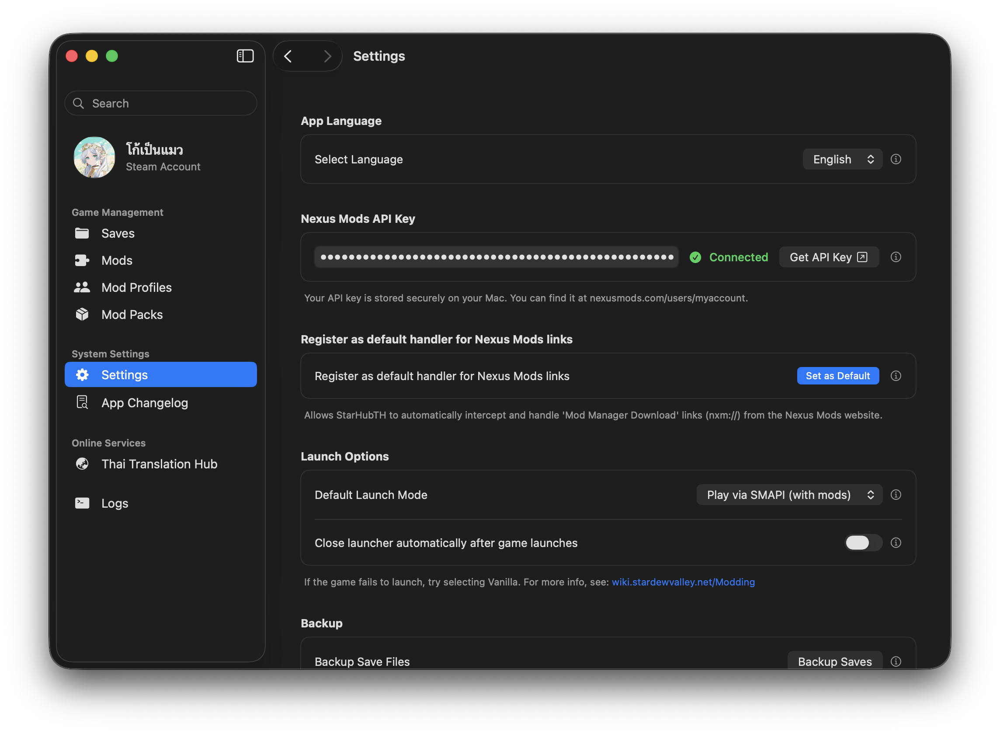 |
| 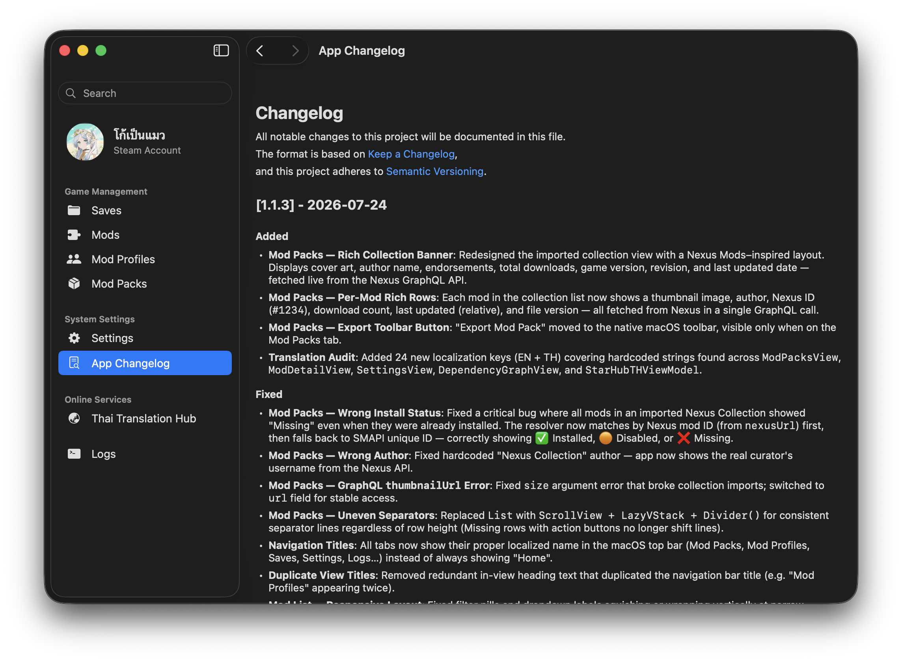 | 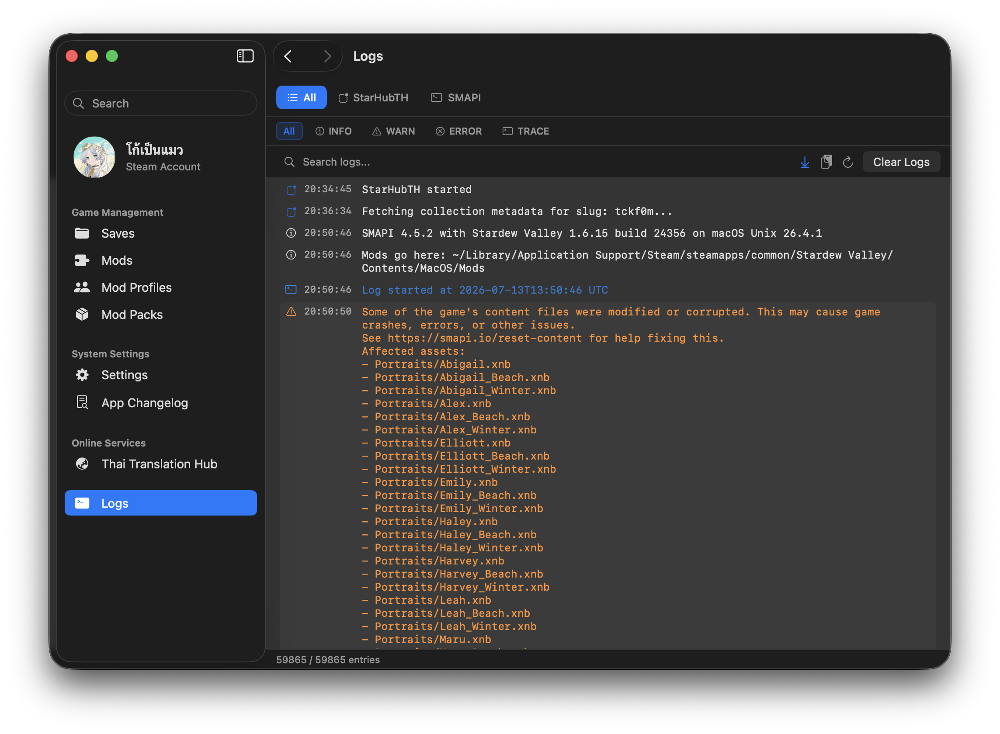 |
| 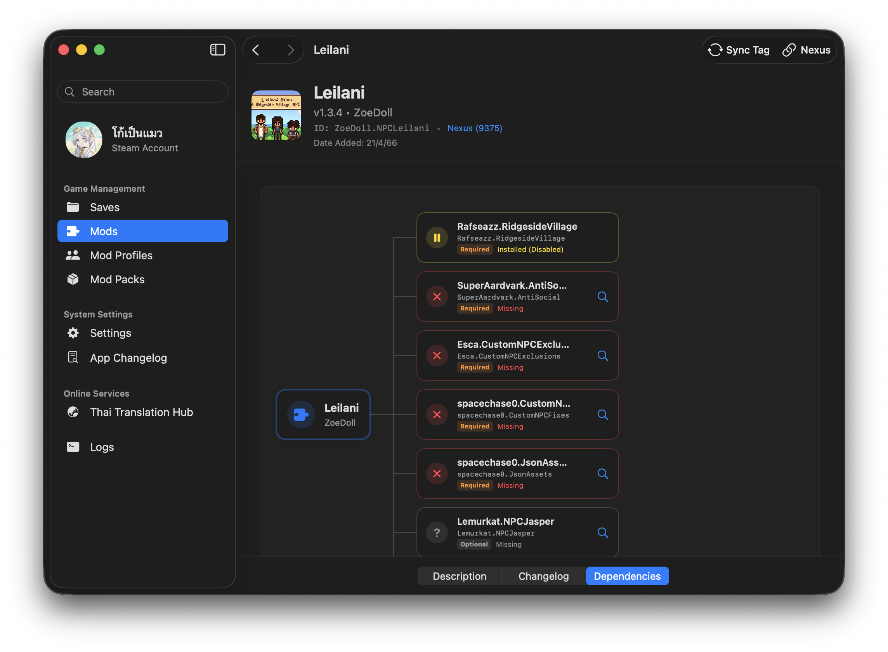 | |

<p align="center">
  
</p>

1. **Download**: Grab the latest release from the [Releases](../../releases) page.
2. **Install**: Unzip the file and drag `StarHubTH.app` into your Applications folder, then double-click to launch.
3. **Set Game Folder**: On first launch, the app will attempt to auto-detect your Steam game folder. If not found, you can manually select the game directory (e.g. `/Applications/Stardew Valley.app/Contents/MacOS`).
4. **You're ready!**: Manage your mods or saves, then hit **"Launch Game"** from the left sidebar.

<p align="center">
  
</p>

This app is built with **Swift** and **SwiftUI** as a native macOS application.

### Requirements
*   macOS 13.0 (Ventura) or later
*   Xcode 15.0 or later (for compiling from source)

### Running the Project
You can open the project in Xcode or compile via Terminal using the build script:
```bash
python3 build_app.py
open StarHubTH.app
```

### Building a Release
To package the app into a `.zip` for distribution:
```bash
python3 release.py
```
Release files will be saved in the `bundles/` folder.

<p align="center">
  
</p>

This project is released under the [MIT License](LICENSE). Feel free to fork, modify, and build upon it.
